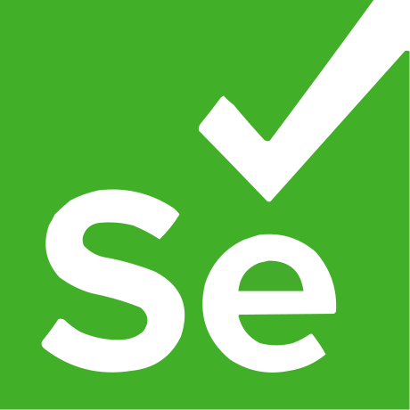

## :technologist: О себе
- Меня зовут Алексей Фадеев 
- Практикую автотестирование на <b>Selenium + Java + Maven</b>  
## :mailbox: Контакты

## :hammer_and_wrench: Технологии и инструменты

## 💼 Мои проекты:
### :heavy_check_mark: UI-тесты на Selenide для страницы сайта IBS.ru.

### :heavy_check_mark: API-тесты для сайта reqres.in

## :fire: Статистика работы на GitHub
\
